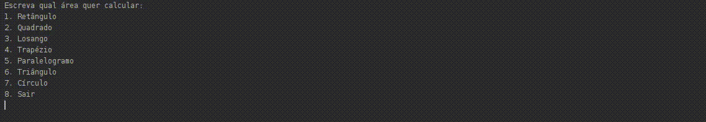

# Hora de Codar!

### Estamos nos primeiros passos de lógica de programação!

### Parabéns a você que está aguentando a jornada e desenvolvendo suas habilidades com primor. 

### Agora é botar a mão em uma pequena sequência de exercícios. 

### Boa sorte. 

---

### 1
<a href="../Preview/Hora_de_Codar/readmes/Hora-de-Codar.md">
</img>
</a>
 
 Escreva um programa que crie uma variável chamada "nome_do_carro" e atribua-a um valor "Fusca". Exiba-a ao usuário.

 ---

### 2
<a href="../Preview/Hora_de_Codar/readmes/Hora-de-Codar.md">
</img>
</a>
 
Escreva um programa em que o usuário informe o seu nome e exiba a mensagem "Olá, [NomeDoUsuario]".
 
 ---

### 3
<a href="../Preview/Hora_de_Codar/readmes/Hora-de-Codar.md">
</img>
</a>
 
Escreva um programa em que o usuário informe o seu nome e em seguida o programa perguntará a idade do usuário. Agora o programa deve exibir a mensagem "Olá, [NomeDoUsuario], sua idade é [idade]".

 ---

### 4
<a href="../Preview/Hora_de_Codar/readmes/Hora-de-Codar.md">
</img>
</æ>
 
Considerando a figura abaixo, escreva um programa para cada forma que calcule e exiba em tela cada uma de suas respectivas áreas. O usuário irá informar os valores de cada variável.

 ---
